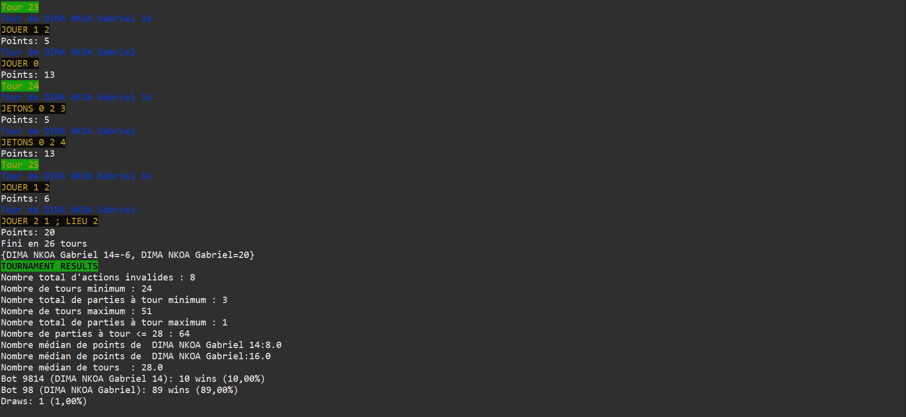
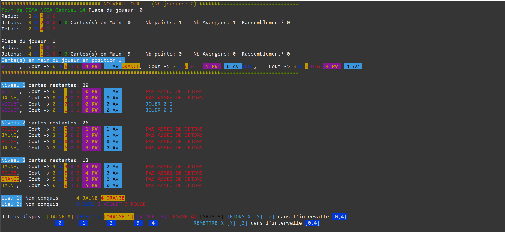

# SplendorMarvel

SplendorMarvel est une implémentation Java du jeu de société Splendor dans l'univers Marvel. Ce projet permet de jouer contre l'ordinateur ou d'autres joueurs, et inclut plusieurs stratégies d'IA.

## Fonctionnalités principales
- Jeu complet de Splendor Marvel
- IA avec différentes stratégies
- Mode tournoi
- Interface en ligne de commande

## Utilisation

La **classe principale** à exécuter est `SplendorMarvel`.

Pour jouer une partie :
1. Choisissez deux stratégies d'IA ou un joueur humain et une IA.
2. Lancez la classe `SplendorMarvel`.
3. Suivez les instructions dans la console pour jouer la partie.

Pour organiser un tournoi :
- Il est possible de lancer un mode tournoi où plusieurs stratégies s'affrontent automatiquement.
- Suivez les instructions affichées lors du lancement de la classe principale pour accéder au mode tournoi.

## Structure du projet
```
SplendorMarvel/
├── src/                  # Code source principal (Maven)
├── splendormarvel/       # Code source (format Eclipse)
├── target/               # Fichiers compilés (à ignorer)
├── pom.xml               # Configuration Maven
├── build.xml             # Script Ant
├── .gitignore            # Fichiers/dossiers ignorés par Git
```

## Aperçu du jeu

Voici un exemple d'affichage lors d'une partie :


Exemple d'affichage du plateau :


## Prérequis
- Java 8 ou supérieur
- Maven (recommandé) ou Ant

## Compilation et exécution

### Avec Maven
```sh
mvn clean package
java -cp target/classes splendormarvel.SplendorMarvel
```

### Avec Ant
```sh
ant clean
ant jar
java -cp build/classes splendormarvel.SplendorMarvel
```

## Auteurs
- Gabriel DIMA NKOA
- Jérémie Humeau

## Licence
Ce projet est sous licence MIT. Voir le fichier LICENSE. 